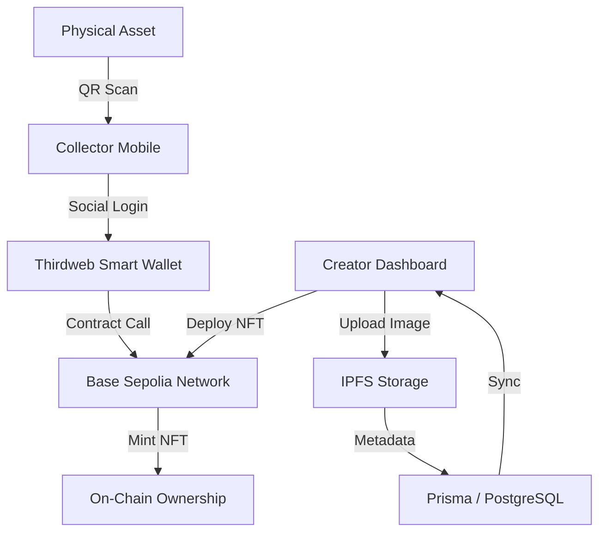

  
  <h1>Phygital NFT Platform (Web3Hunt)</h1>
  
<b>Bridge the Physical world to the Base Blockchain in seconds.</b>

  
  
  

---

## 🚀 Overview

**Phygital** is a next-generation NFT platform designed to turn physical objects into on-chain assets. By bridging the gap between physical items and digital ownership, it enables creators to generate unique QR codes that collectors can scan to claim ERC-1155 NFTs instantly—with **zero gas fees** and **no seed phrases**.

### Key Features
- 📱 **Instant Scanning**: Claim NFTs directly via mobile camera (no app required).
- 🔐 **Invisible Wallets**: Social/Email login creates a self-custody smart wallet in the background.
- ⚡ **Gasless Experience**: Transacting on Base Sepolia with platform-sponsored gas.
- 🛠️ **Creator Suite**: IPFS image hosting, custom traits, claim limits, and secret-code gating.
- 🔥 **Soulbound Support**: Create non-transferable NFTs for diplomas or certificates.

---

## 🛠 Tech Stack Specification

We have chosen a high-performance stack optimized for scalability, developer velocity, and premium user experience.

| Layer | Technology | Purpose |
| :--- | :--- | :--- |
| **Framework** | [Next.js 14](https://nextjs.org/) (App Router) | Core application architecture & SSR |
| **Language** | [TypeScript](https://www.typescriptlang.org/) | Type-safe development |
| **Web3 / Wallets** | [Thirdweb SDK v5](https://thirdweb.com/) | Smart wallet & Contract interaction |
| **Database Architecture** | [Prisma](https://www.prisma.io/) + PostgreSQL | Type-safe ORM & Relational storage |
| **Styling** | [Tailwind CSS](https://tailwindcss.com/) | Utility-first aesthetics |
| **Animations** | [Framer Motion](https://www.framer.com/motion/) | Premium micro-interactions |
| **UI Components** | [Radix UI](https://www.radix-ui.com/) | Accessible component primitives |
| **DevOps / Hosting** | [Vercel](https://vercel.com/) + [Docker](https://www.docker.com/) | Continuous deployment & Containerization |

---

## 📊 Performance Benchmarks

The application is optimized for the **Base Network** to ensure sub-second interactions and minimal build footprints.

### Build Metrics
- **Build Time**: ~45.2 seconds (Standard optimized build)
- **First Load JS (Shared)**: 102 kB (Gzipped)
- **Dashboard Load**: 124 kB (Route specific)
- **Prisma Client Gen**: 57ms

### Network & UX Benchmarks
- **QR Decoding Speed**: <200ms
- **Social Login Latency**: ~1.2s (Wallet creation + Auth)
- **Transaction Confirmation**: ~450ms (Base Sepolia average)

### Optimization Graph

---

## 🏗 Architecture Overview

---

## 🛠 Getting Started

### Prerequisites
- Node.js 18+
- Docker (for local DB)
- Thirdweb Client ID

### Installation
1. Clone the repository: `git clone <repo-url>`
2. Install dependencies: `npm install`
3. Set up `.env` file with your credentials.
4. Run Docker: `docker-compose up -d`
5. Start development: `npm run dev`

---

## 📜 License
Distritubed under the MIT License. See `LICENSE` for more information.

---

  
Built with ❤️ for the Phygital Future

